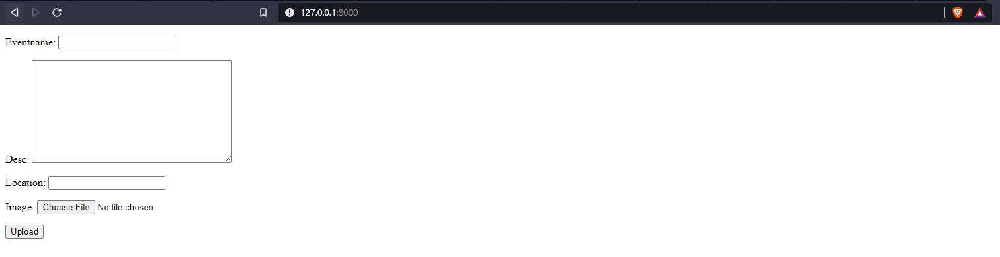
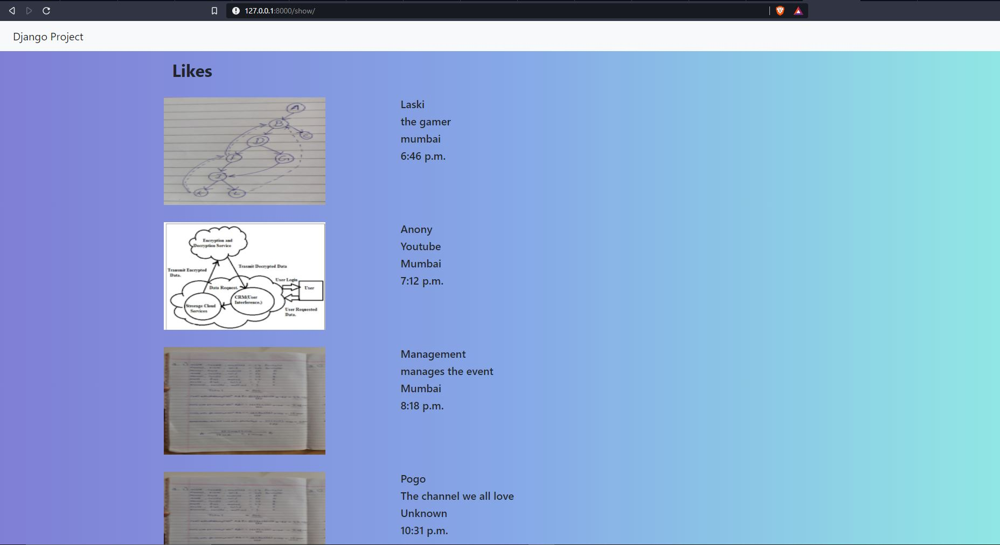

# DjangoProject
This is an django project where a user can add eventname, it's descritpion, location and can also upload a image. This all data will be displayed on an another page.

# Screenshots

